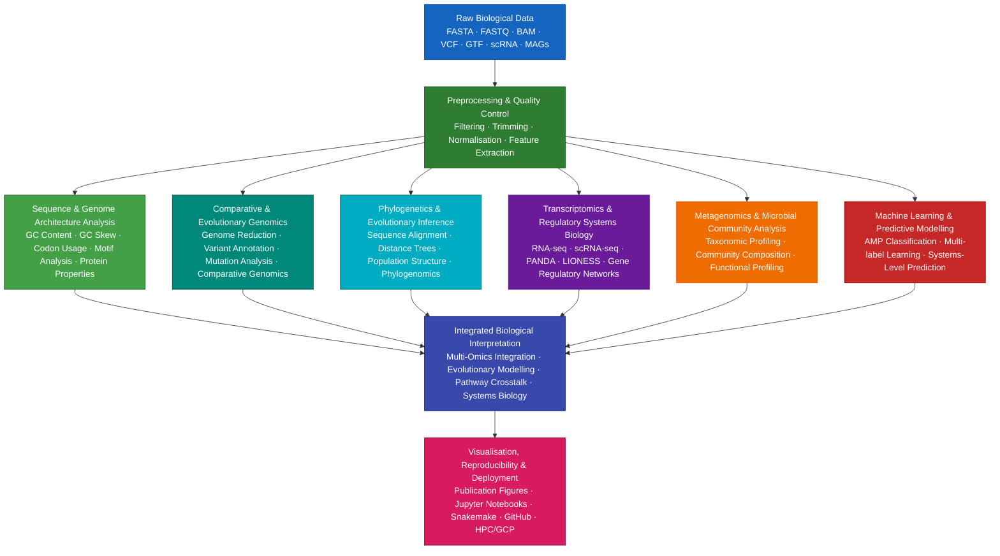

# 🧬 Computational Biology Toolkit for Genomic Analysis

[](LICENSE)


## 📘 Overview

This repository documents an independently developed computational biology and evolutionary genomics framework built alongside formal training in Genomic Science. The project integrates modular analytical tools, scalable workflows, and systems-level inference approaches spanning comparative genomics, transcriptomics, metagenomics, regulatory network biology, microbial evolution, and machine learning.

The repository began with foundational sequence-analysis utilities and progressively expanded into large-scale computational workflows for comparative and evolutionary genomics, genome architecture analysis, transcriptomics, single-cell analysis, and patient-specific regulatory network inference. Current work includes archaeal genome organisation analysis, comparative genome reduction modelling, metagenomic profiling, and gene regulatory network reconstruction using PANDA and LIONESS on TCGA ovarian cancer datasets.

Rather than functioning as isolated scripts, the modules are designed as interoperable components for reproducible biological inference across heterogeneous datasets and biological scales — from nucleotide-level sequence analysis through to systems-level modelling of cellular regulation and evolutionary processes.

The repository emphasizes:

* reproducible computational biology,
* modular workflow design,
* scalable genomics analysis,
* evolutionary and systems-level interpretation,
* compatibility with HPC and cloud-native environments including GCP.

---

## 🌟 Key Features

* Modular computational biology toolkit spanning genomics, transcriptomics, metagenomics, and systems biology
* Support for standard biological data formats (FASTA, FASTQ, BAM, VCF, GTF/GFF, expression matrices)
* Reproducible workflow-oriented design compatible with HPC and cloud environments
* Lightweight analytical implementations for rapid prototyping and exploratory research
* Comparative and evolutionary genomics utilities for microbial and eukaryotic systems
* Integrated support for statistical analysis, visualisation, and biological interpretation
* Applicable across microbial, plant, animal, and human genomics datasets

---

## 🔬 Functional Areas

### 🧬 Sequence Analysis & Genome Architecture

* GC content and cumulative GC skew analysis
* Codon usage profiling and compositional analysis
* DNA translation and protein sequence analysis
* Protein motif detection and amino acid property analysis
* Promoter and regulatory motif scanning
* Pairwise alignment scoring (Needleman–Wunsch / Smith–Waterman)

### 🌍 Comparative & Evolutionary Genomics

* Comparative genome analysis and mutation annotation
* Genome reduction and streamlining inference
* Phylogenetic tree construction and evolutionary distance analysis
* Population structure and divergence analysis
* Comparative microbial and archaeal genomics workflows
* Replication-associated genome organisation analysis

### 🧪 Transcriptomics & Regulatory Systems Biology

* Bulk RNA-seq analysis and expression visualisation
* Single-cell RNA-seq workflows
* Differential expression and pathway enrichment analysis
* Gene regulatory network inference using PANDA and LIONESS
* Patient-specific network modelling on TCGA datasets
* Pathway interaction and systems-level crosstalk analysis

### 🌐 Metagenomics & Multi-Omics Integration

* Taxonomic and functional metagenomic profiling
* Community-level sequence analysis
* Multi-omics data integration
* Functional interpretation of heterogeneous biological datasets

### 🤖 Machine Learning & Predictive Modelling

* Multi-label classification of antimicrobial proteins
* Predictive modelling workflows for biological datasets
* Feature engineering for high-dimensional omics data
* Exploratory machine learning integration for systems biology applications

---

## ⚙️ Infrastructure & Reproducibility

The repository is designed around reproducible and scalable computational research practices:

* Python-based modular architecture
* Workflow compatibility with Snakemake and HPC systems
* Cloud-compatible execution (including GCP)
* Git-based version control and reproducible analysis tracking
* Notebook-driven exploratory analysis and visualisation workflows

The long-term direction of the project is the development of scalable computational frameworks for comparative genomics, systems biology, and evolutionary inference across complex biological datasets.

---

## ⚙️ Workflow Integration

Tools can operate independently or as components of a complete analysis pipeline.


```mermaid
graph TD

  A["Raw Biological Data<br/>FASTA · FASTQ · BAM · VCF · GTF · scRNA · MAGs"] 

  --> B["Preprocessing & Quality Control<br/>Filtering · Trimming · Normalisation · Feature Extraction"]

  %% =====================================================
  %% CORE ANALYTICAL MODULES
  %% =====================================================

  B --> C["Sequence & Genome Architecture Analysis<br/>GC Content · GC Skew · Codon Usage · Motif Analysis · Protein Properties"]

  B --> D["Comparative & Evolutionary Genomics<br/>Genome Reduction · Variant Annotation · Mutation Analysis · Comparative Genomics"]

  B --> E["Phylogenetics & Evolutionary Inference<br/>Sequence Alignment · Distance Trees · Population Structure · Phylogenomics"]

  B --> F["Transcriptomics & Regulatory Systems Biology<br/>RNA-seq · scRNA-seq · PANDA · LIONESS · Gene Regulatory Networks"]

  B --> G["Metagenomics & Microbial Community Analysis<br/>Taxonomic Profiling · Community Composition · Functional Profiling"]

  B --> H["Machine Learning & Predictive Modelling<br/>AMP Classification · Multi-label Learning · Systems-Level Prediction"]

  %% =====================================================
  %% INTEGRATION LAYER
  %% =====================================================

  C --> I["Integrated Biological Interpretation<br/>Multi-Omics Integration · Evolutionary Modelling · Pathway Crosstalk · Systems Biology"]

  D --> I
  E --> I
  F --> I
  G --> I
  H --> I

  %% =====================================================
  %% OUTPUT
  %% =====================================================

  I --> J["Visualisation, Reproducibility & Deployment<br/>Publication Figures · Jupyter Notebooks · Snakemake · GitHub · HPC/GCP"]

  %% =====================================================
  %% COLOR CLASSES
  %% =====================================================

  classDef raw fill:#1565c0,stroke:#0d47a1,color:#fff
  classDef qc fill:#2e7d32,stroke:#1b5e20,color:#fff

  classDef seq fill:#43a047,stroke:#1b5e20,color:#fff
  classDef evo fill:#00897b,stroke:#004d40,color:#fff
  classDef phylo fill:#00acc1,stroke:#006064,color:#fff

  classDef reg fill:#6a1b9a,stroke:#4a148c,color:#fff
  classDef meta fill:#ef6c00,stroke:#e65100,color:#fff
  classDef ml fill:#c62828,stroke:#8e0000,color:#fff

  classDef integrate fill:#3949ab,stroke:#1a237e,color:#fff
  classDef output fill:#d81b60,stroke:#880e4f,color:#fff

  %% =====================================================
  %% APPLY CLASSES
  %% =====================================================

  class A raw
  class B qc

  class C seq
  class D evo
  class E phylo
  class F reg
  class G meta
  class H ml

  class I integrate
  class J output
```


## 📂 Available Scripts

| Script | Function | Current Status |
|--------|----------|----------------|
| `codon_analysis.py` | Codon usage analysis | Completed|
| `dna-protein.py` | Six-frame DNA translation | Completed|
| `gc_skew_calc.py` | Archaeal GC Skew Analysis | Completed|
| `gc_calc_pwa.py` | Comparative GC analysis | Completed |
| `phylogenetic_analysis.py` | Distance-based tree construction | Completed |
| `promoter_id.py` | Promoter/motif scanning | Completed |
| `protein_property.py` | Amino acid property analysis | Completed |
| `protein_seq_motif.py` | Protein motif detection | Completed |
| `rna_analysis.py` | RNA-seq processing and visualization | Completed |
| `seq_align_score_calc.py` | Alignment scoring (Needleman–Wunsch / Smith–Waterman) | Completed |
| `variant_annotation.py` | Variant functional annotation | Completed |
| `metagenomic.py` | Metagenomic profiling | Completed |
|`mutation_annotation.py`| Annotation of mutations | Completed |
| `adhesion_metabolism_crosstalk.py` | Pathway interaction analysis | Completed |
| `somatic_variation.py` | Comparative genome analysis | Completed |
| `gen_red_inf.py` | Comparative Genome Reduction Pipeline | Completed |
| `scrna.ipynb` | Single-cell RNA seq data analysis | Completed |
|`panda_lioness.ipynb`|Gene Regulatory Network analysis| Currently being run on the GCP platform.|
|`ampml.ipynb`|Multi-label classification of antimicrobial proteins| Complete |
---

## 🧪 Example Use Cases

* Analyse genome architecture, replication symmetry, and compositional bias across archaeal, bacterial, and eukaryotic genomes
* Perform comparative genomics and genome reduction analyses in microbial and symbiotic systems
* Construct phylogenetic relationships and investigate evolutionary divergence across populations or species
* Detect regulatory motifs, promoter regions, and protein sequence signatures associated with functional adaptation
* Annotate genomic variants and evaluate potential functional or evolutionary consequences
* Process and visualise bulk RNA-seq and single-cell transcriptomic datasets
* Infer patient-specific gene regulatory networks using PANDA and LIONESS frameworks
* Profile microbial community composition and functional potential from metagenomic sequencing data
* Integrate heterogeneous omics datasets for pathway-level and systems biology interpretation
* Develop and prototype scalable computational workflows prior to HPC or cloud-scale deployment
* Apply machine learning approaches to biological sequence classification and predictive modelling tasks

---

## ⚙️ Installation

### Requirements

- Python 3.7+
- Biopython
- Standard scientific Python stack (NumPy, Pandas, Matplotlib)

### Setup

```bash
git clone https://github.com/Aridoge13/Computational_Biology.git
cd Computational_Biology

pip install biopython matplotlib seaborn pandas numpy pysam 'scanpy[leiden]'
```
#the extra [leiden] installs two packages that are needed for popular parts of scanpy but aren’t requirements: `igraph` [Csárdi and Nepusz, 2006] and `leiden` [Traag et al., 2019]

### Tools for Specific Modules
```bash
#structural variant analysis
pip install sniffles

#Gene Regulatory Network Analysis
pip install netzoopy pyarrow

# Pangenome Construction
git clone https://github.com/lh3/minigraph
cd minigraph && make
```

## Design Principles
- Modularity: Components can be reused in custom workflows
- Reproducibility: Deterministic outputs with documented dependencies
- Clarity: Readable implementations suitable for learning and extension
- Scalability: Applicable from small datasets to HPC environments

## Contribution
Issues, feature requests, and pull requests are welcome.

## License
Distributed under the [MIT License](License.md)
