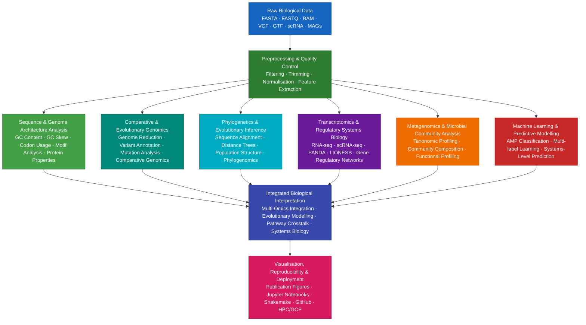

# 🧬 Computational Biology Toolkit for Genomic Analysis

[](LICENSE)


## 📘 Overview

This repository documents a self-directed programme of computational biology work developed independently alongside formal academic training in Genomic Science. It is organised as a modular collection of Python tools and analytical notebooks spanning population genomics, cancer genomics, regulatory network inference, transcriptomics, and metagenomics. 

The work reflects a deliberate progression toward systems-level approaches to understanding disease heterogeneity — from foundational sequence analysis and variant annotation through to single-cell RNA-seq workflows and patient-specific gene regulatory network inference using PANDA and LIONESS on TCGA ovarian cancer data. Tools are designed for reproducibility and modularity, and are compatible with HPC and cloud environments including GCP.
---

## 🌟 Key Features

- Supports standard genomic formats (FASTA, VCF, GTF, BAM, etc.)
- Modular design — tools can be used independently or combined into workflows
- Minimal dependencies and lightweight implementations
- Suitable for rapid prototyping, teaching, and reproducible research
- Compatible with automation frameworks and HPC environments
- Applicable across microbial, plant, animal, and human genomics

---

## 🔬 Functional Areas

### 🧬 Genome & Variant Analysis
- Variant annotation and prioritization
- Structural and sequence-level variation analysis
- Codon usage and GC content profiling
- Motif and regulatory region detection
- Sequence alignment scoring

### 🌍 Evolutionary & Population Analysis
- Phylogenetic tree construction
- Population structure inference
- Selection and divergence analysis
- Comparative genomics workflows

### 🧪 Transcriptomics & Functional Analysis
- RNA-seq differential expression workflows
- Expression visualization and clustering
- Functional enrichment and pathway analysis
- scRNA-seq data analysis

### 🌐 Metagenomics & Multi-omics
- Taxonomic and functional profiling
- Community-level sequence analysis
- Integration of heterogeneous datasets

### 🛠️ Applied Genomics Modules (Optional)
Additional modules support domain-specific analyses such as structural variant interpretation, pangenome construction, and genetic load estimation.

---

## ⚙️ Workflow Integration

Tools can operate independently or as components of a complete analysis pipeline.


```mermaid
graph TD

  A["Raw Biological Data<br/>FASTA · FASTQ · BAM · VCF · GTF · scRNA · MAGs"] 

  --> B["Preprocessing & Quality Control<br/>Filtering · Trimming · Normalisation · Feature Extraction"]

  %% =====================================================
  %% CORE ANALYTICAL MODULES
  %% =====================================================

  B --> C["Sequence & Genome Architecture Analysis<br/>GC Content · GC Skew · Codon Usage · Motif Analysis · Protein Properties"]

  B --> D["Comparative & Evolutionary Genomics<br/>Genome Reduction · Variant Annotation · Mutation Analysis · Comparative Genomics"]

  B --> E["Phylogenetics & Evolutionary Inference<br/>Sequence Alignment · Distance Trees · Population Structure · Phylogenomics"]

  B --> F["Transcriptomics & Regulatory Systems Biology<br/>RNA-seq · scRNA-seq · PANDA · LIONESS · Gene Regulatory Networks"]

  B --> G["Metagenomics & Microbial Community Analysis<br/>Taxonomic Profiling · Community Composition · Functional Profiling"]

  B --> H["Machine Learning & Predictive Modelling<br/>AMP Classification · Multi-label Learning · Systems-Level Prediction"]

  %% =====================================================
  %% INTEGRATION LAYER
  %% =====================================================

  C --> I["Integrated Biological Interpretation<br/>Multi-Omics Integration · Evolutionary Modelling · Pathway Crosstalk · Systems Biology"]

  D --> I
  E --> I
  F --> I
  G --> I
  H --> I

  %% =====================================================
  %% OUTPUT
  %% =====================================================

  I --> J["Visualisation, Reproducibility & Deployment<br/>Publication Figures · Jupyter Notebooks · Snakemake · GitHub · HPC/GCP"]

  %% =====================================================
  %% COLOR CLASSES
  %% =====================================================

  classDef raw fill:#1565c0,stroke:#0d47a1,color:#fff
  classDef qc fill:#2e7d32,stroke:#1b5e20,color:#fff

  classDef seq fill:#43a047,stroke:#1b5e20,color:#fff
  classDef evo fill:#00897b,stroke:#004d40,color:#fff
  classDef phylo fill:#00acc1,stroke:#006064,color:#fff

  classDef reg fill:#6a1b9a,stroke:#4a148c,color:#fff
  classDef meta fill:#ef6c00,stroke:#e65100,color:#fff
  classDef ml fill:#c62828,stroke:#8e0000,color:#fff

  classDef integrate fill:#3949ab,stroke:#1a237e,color:#fff
  classDef output fill:#d81b60,stroke:#880e4f,color:#fff

  %% =====================================================
  %% APPLY CLASSES
  %% =====================================================

  class A raw
  class B qc

  class C seq
  class D evo
  class E phylo
  class F reg
  class G meta
  class H ml

  class I integrate
  class J output
```


## 📂 Available Scripts

| Script | Function | Current Status |
|--------|----------|----------------|
| `codon_analysis.py` | Codon usage analysis | Completed|
| `dna-protein.py` | Six-frame DNA translation | Completed|
| `gc_skew_calc.py` | Archaeal GC Skew Analysis | Completed|
| `gc_calc_pwa.py` | Comparative GC analysis | Completed |
| `phylogenetic_analysis.py` | Distance-based tree construction | Completed |
| `promoter_id.py` | Promoter/motif scanning | Completed |
| `protein_property.py` | Amino acid property analysis | Completed |
| `protein_seq_motif.py` | Protein motif detection | Completed |
| `rna_analysis.py` | RNA-seq processing and visualization | Completed |
| `seq_align_score_calc.py` | Alignment scoring (Needleman–Wunsch / Smith–Waterman) | Completed |
| `variant_annotation.py` | Variant functional annotation | Completed |
| `metagenomic.py` | Metagenomic profiling | Completed |
|`mutation_annotation.py`| Annotation of mutations | Completed |
| `adhesion_metabolism_crosstalk.py` | Pathway interaction analysis | Completed |
| `somatic_variation.py` | Comparative genome analysis | Completed |
| `gen_red_inf.py` | Comparative Genome Reduction Pipeline | Completed |
| `scrna.ipynb` | Single-cell RNA seq data analysis | Completed |
|`panda_lioness.ipynb`|Gene Regulatory Network analysis| Currently being run on the GCP platform.|
|`ampml.ipynb`|Multi-label classification of antimicrobial proteins| Complete |
---

## 🧪 Example Use Cases

- Characterize sequence composition and codon bias across genes or species  
- Annotate variants and prioritize functional candidates  
- Infer evolutionary relationships from genomic data  
- Analyze RNA-seq expression patterns  
- Profile microbial communities from shotgun sequencing  
- Prototype analysis pipelines before large-scale deployment  

---

## ⚙️ Installation

### Requirements

- Python 3.7+
- Biopython
- Standard scientific Python stack (NumPy, Pandas, Matplotlib)

### Setup

```bash
git clone https://github.com/Aridoge13/Computational_Biology.git
cd Computational_Biology

pip install biopython matplotlib seaborn pandas numpy pysam 'scanpy[leiden]'
```
#the extra [leiden] installs two packages that are needed for popular parts of scanpy but aren’t requirements: `igraph` [Csárdi and Nepusz, 2006] and `leiden` [Traag et al., 2019]

### Tools for Specific Modules
```bash
#structural variant analysis
pip install sniffles

#Gene Regulatory Network Analysis
pip install netzoopy pyarrow

# Pangenome Construction
git clone https://github.com/lh3/minigraph
cd minigraph && make
```

## Design Principles
- Modularity: Components can be reused in custom workflows
- Reproducibility: Deterministic outputs with documented dependencies
- Clarity: Readable implementations suitable for learning and extension
- Scalability: Applicable from small datasets to HPC environments

## Contribution
Issues, feature requests, and pull requests are welcome.

## License
Distributed under the [MIT License](License.md)
