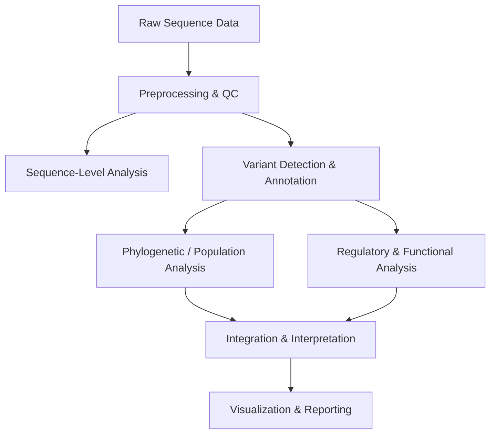

# 🧬 Computational Biology Toolkit for Genomic Analysis

[](LICENSE)


## 📘 Overview

A modular collection of Python tools for genome-scale analysis, population genetics, and sequence-based inference.  
Designed for flexibility, clarity, and reproducibility, this toolkit supports exploratory research, teaching, and lightweight pipeline development across diverse biological systems.

The repository integrates core bioinformatics tasks — from sequence processing and variant interpretation to phylogenetic, transcriptomic, and metagenomic analysis — and is applicable to both model and non-model organisms.

---

## 🌟 Key Features

- Supports standard genomic formats (FASTA, VCF, GTF, BAM, etc.)
- Modular design — tools can be used independently or combined into workflows
- Minimal dependencies and lightweight implementations
- Suitable for rapid prototyping, teaching, and reproducible research
- Compatible with automation frameworks and HPC environments
- Applicable across microbial, plant, animal, and human genomics

---

## 🔬 Functional Areas

### 🧬 Genome & Variant Analysis
- Variant annotation and prioritization
- Structural and sequence-level variation analysis
- Codon usage and GC content profiling
- Motif and regulatory region detection
- Sequence alignment scoring

### 🌍 Evolutionary & Population Analysis
- Phylogenetic tree construction
- Population structure inference
- Selection and divergence analysis
- Comparative genomics workflows

### 🧪 Transcriptomics & Functional Analysis
- RNA-seq differential expression workflows
- Expression visualization and clustering
- Functional enrichment and pathway analysis

### 🌐 Metagenomics & Multi-omics
- Taxonomic and functional profiling
- Community-level sequence analysis
- Integration of heterogeneous datasets

### 🛠️ Applied Genomics Modules (Optional)
Additional modules support domain-specific analyses such as structural variant interpretation, pangenome construction, and genetic load estimation.

---

## ⚙️ Workflow Integration

Tools can operate independently or as components of a complete analysis pipeline.


```mermaid
graph TD
  A[Raw Sequence Data] --> B[Preprocessing & QC]
  B --> C[Sequence-Level Analysis]
  B --> D[Variant Detection & Annotation]
  D --> E[Phylogenetic / Population Analysis]
  D --> F[Regulatory & Functional Analysis]
  E --> G[Integration & Interpretation]
  F --> G
  G --> H[Visualization & Reporting]
```

## 📂 Available Scripts

| Script | Function |
|--------|----------|
| `codon_analysis.py` | Codon usage analysis |
| `dna-protein.py` | Six-frame DNA translation |
| `gc_calc.py` | GC content profiling |
| `gc_calc_pwa.py` | Comparative GC analysis |
| `phylogenetic_analysis.py` | Distance-based tree construction |
| `promoter_id.py` | Promoter/motif scanning |
| `protein_property.py` | Amino acid property analysis |
| `protein_seq_motif.py` | Protein motif detection |
| `rna_analysis.py` | RNA-seq processing and visualization |
| `seq_align_score_calc.py` | Alignment scoring (Needleman–Wunsch / Smith–Waterman) |
| `variant_annotation.py` | Variant functional annotation |
| `metagenomic.py` | Metagenomic profiling |
| `adhesion_metabolism_crosstalk.py` | Pathway interaction analysis |
| `somatic_variation.py` | Comparative genome analysis |

---

## 🧪 Example Use Cases

- Characterize sequence composition and codon bias across genes or species  
- Annotate variants and prioritize functional candidates  
- Infer evolutionary relationships from genomic data  
- Analyze RNA-seq expression patterns  
- Profile microbial communities from shotgun sequencing  
- Prototype analysis pipelines before large-scale deployment  

---

## ⚙️ Installation

### Requirements

- Python 3.7+
- Biopython
- Standard scientific Python stack (NumPy, Pandas, Matplotlib)

### Setup

```bash
git clone https://github.com/Aridoge13/Computational_Biology.git
cd Computational_Biology

pip install biopython matplotlib seaborn pandas numpy pysam
```

### Optional Tools for Specific Modules
```bash
#structural variant analysis
pip install sniffles

# Pangenome Construction
git clone https://github.com/lh3/minigraph
cd minigraph && make
```

## Design Principles
- Modularity: Components can be reused in custom workflows
- Reproducibility: Deterministic outputs with documented dependencies
- Clarity: Readable implementations suitable for learning and extension
- Scalability: Applicable from small datasets to HPC environments

## Contribution
Issues, feature requests, and pull requests are welcome.

## License
Distributed under the [MIT License](License.md)
