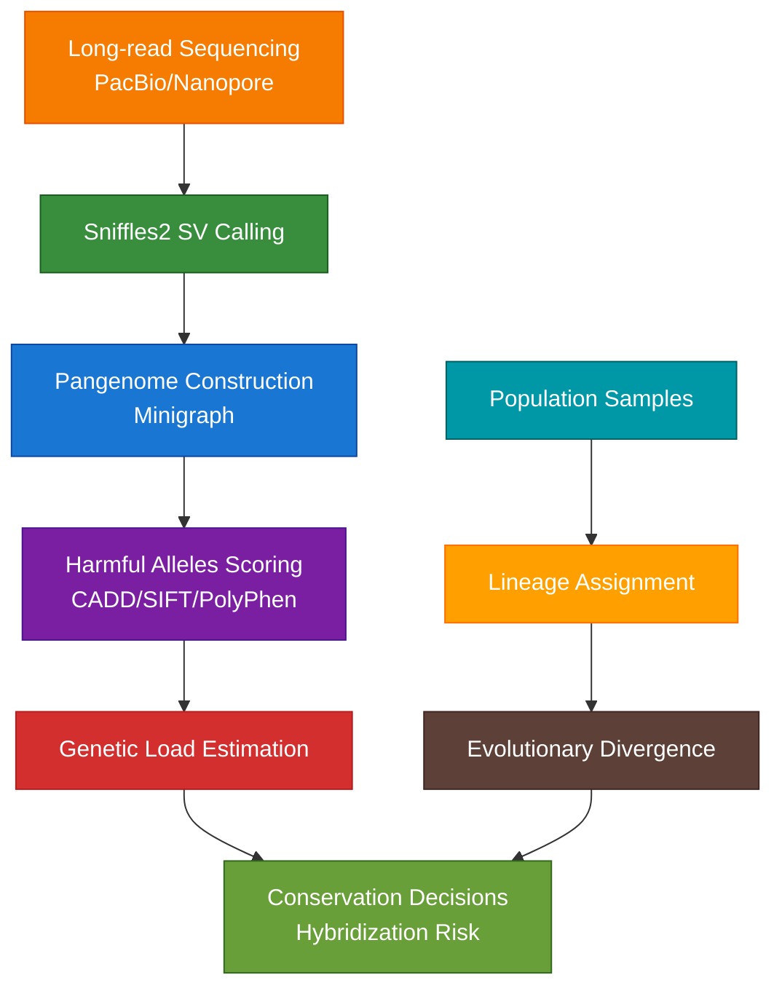
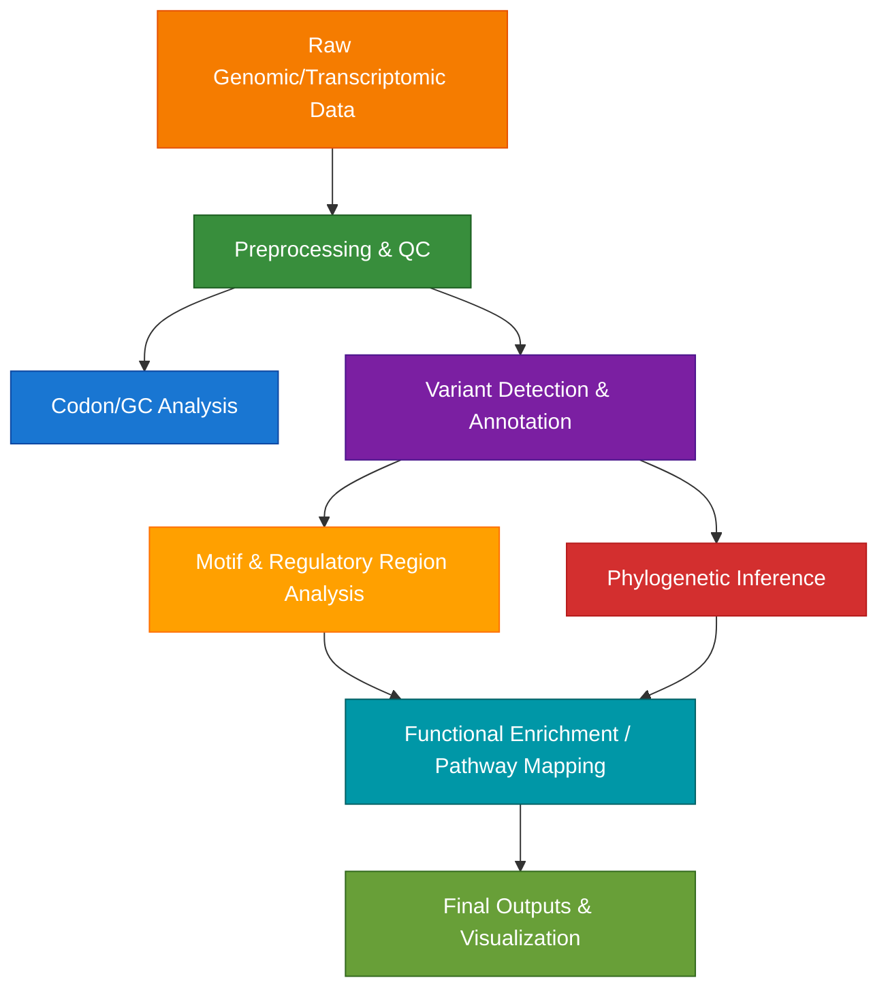

# 🧬 Computational Biology Toolkit for Evolutionary and Conservation Genomics
[](LICENSE)


## 📘 Description
A comprehensive collection of Python tools for computational biology, with specialized modules for **conservation genomics** and **evolutionary analysis**. This toolkit bridges traditional bioinformatics with cutting-edge conservation applications, featuring:

- **Conservation Genomics**: Structural variant calling, harmful alleles scoring, pangenome analysis.
- **Evolutionary Analysis**: Phylogenetics, population genetics, lineage assessment.  
- **Genomic Workflows**: Variant annotation, sequence analysis, transcriptomics.
- **Multi-omics Integration**: Metagenomics, regulatory genomics, pathway analysis.

Originally developed to support graduate-level research, this toolkit is suitable for researchers and students working across diverse biological datasets — from large mammalian genomes to microbial communities.

---

## 🌟 Highlights

- Supports standard file formats (FASTA, VCF, GTF, etc.)
- Minimal dependencies and lightweight structure
- Suitable for both exploration and automation
- Great for teaching and rapid prototyping of pipelines 
- **Conservation-Focused**: Specialized tools for endangered species genomics
- **Production-Ready**: Includes real tool commands (Sniffles2, Minigraph, CADD)
- **Modular Design**: Use individually or in integrated workflows
- **Resource-Efficient**: Lightweight implementations suitable for diverse computing environments
- **Reproducible**: Well-documented with version control and environment management


---
## 🧪 Project Features
### Core Functionalities

#### **Conservation Genomics**
- Structural variant calling and annotation
- Deleterious alleles scoring and genetic load estimation
- Pangenome graph construction and analysis
- Lineage divergence and hybridization assessment

#### **Evolutionary & Population Genetics**
- Phylogenetic tree construction and analysis
- Population structure inference
- Selection pressure analysis
- Demographic history modeling

#### **Genomic Analysis**
- Variant annotation and prioritization
- Sequence alignment and comparison
- Regulatory element detection
- Metagenomic profiling

#### **Transcriptomics**
- RNA-seq differential expression
- Expression visualization and clustering
- Functional enrichment analysis


---

### **Conservation Genomics Workflow**
> Specialized pipeline for endangered species genomics:



### Workflow Overview
> The tools in this repository are designed to be modular, but can also be used in sequence as part of a complete analysis workflow. Below is an example of how these components may integrate in a mutation- or expression-driven research pipeline:



---

### Available Scripts (with Applications)

| Script | Description | Use Case |
|--------|-------------|----------|
| `codon_analysis.py` | Codon usage analysis and visualization | Compare codon bias across genes or species |
| `dna-protein.py` | DNA to protein translation in 6 frames | Identify potential ORFs and misannotations |
| `gc_calc.py` | GC content calculation | Assess genomic stability or mutation hotspots |
| `gc_calc_pwa.py` | GC content with pairwise alignment | Compare GC distribution between homologs |
| `phylogenetic_analysis.py` | Tree construction using distance matrices | Infer evolutionary divergence of genes/loci |
| `promoter_id.py` | Motif scanning in upstream regions | Detect conserved promoter motifs |
| `protein_property.py` | Amino acid property summary | Profile hydrophobicity, charge, etc. |
| `protein_seq_motif.py` | Protein motif identification | Detect structural motifs (e.g., kinase domains) |
| `rna_analysis.py` | RNA-Seq processing and visualization | DE analysis, clustering, expression heatmaps |
| `seq_align_score_calc.py` | Needleman-Wunsch / Smith-Waterman scoring | Compare sequence similarity quantitatively |
| `variant_annotation.py` | Annotate genomic variants | Prioritize functional SNPs or clustered mutations |
| `metagenomic.py` | Taxonomic and functional profiling | Analyze shotgun metagenomes (WGS reads) |
| `adhesion_metabolism_crosstalk.py` | Pathway-level interaction mapping | Explore crosstalk between signaling modules |
| `somatic_variation.py` | Compare cancer vs healthy genomes | Detect somatic mutations or LOH regions |


### **New Conservation Modules**
| Module | Description | Application |
|--------|-------------|-------------|
| **`conservation/sv_annotation.py`** | Sniffles2-based structural variant calling with conservation annotation | Asian elephant genomic compatibility |
| **`conservation/genetic_load.py`** | CADD/SIFT/PolyPhen-style deleterious variant scoring | Genetic load estimation for endangered species |
| **`conservation/pangenome_assembly.py`** | Pangenome graph construction and analysis | Lineage-specific variation detection |
---

## 🚀 Use Case Example

> *Process a FASTA file of variant-rich loci, score GC content and codon usage, and run downstream motif analysis to assess regulatory potential.*

This toolkit can be used to generate publication-ready insights from raw sequence data — whether you’re exploring de novo genes, transcript isoforms, or somatic variant landscapes.

> *Call structural variants from long-read mammalian genomes, construct lineage-aware pangenome graphs, and score harmful alleles to assess hybridization risk and genetic rescue potential.*

This conservation genomics extension transforms raw genomic data into conservation-ready insights—from pangenome graphs of endangered populations to genetic load estimates for managed breeding decisions.

---
## Key Benefits
- Efficiency: Streamlined analysis pipelines
- Reproducibility: Consistent results across platforms
- Educational: Well-documented code for learning
- Extensible: Modular design for customization


### Key Benefits for Conservation/Evolutionary Genomics Research
- **Methodological Rigor:** Implements state-of-the-art conservation genomics methods.
- **Scalability:** From lightweight demonstrations to HPC-scale production.
- **Interoperability:** Works with standard tools (Sniffles2, Minigraph, VCFtools).
- **Actionable Outputs:** Generates conservation-relevant reports and prioritizations.
- **Educational Value:** Well-documented code suitable for teaching and collaboration.

---

## ⚙️ Installation
### Requirements
- Python 3.7+
- Biopython
- Common scientific Python stack (NumPy, Pandas, Matplotlib)
---

### Setup
```bash
# Clone the repository
git clone https://github.com/Aridoge13/Computational_Biology.git


# Install dependencies
pip install biopython matplotlib seaborn pandas numpy pysam sniffles
```

To run the pangenome assembly script you would need to install minigraph
```bash
# Clone the repository which contains the minigraph module
git clone https://github.com/lh3/minigraph
cd minigraph && make
```
---

## 🤝 Contribution
Feedback, forks, and pull requests are welcome! Feel free to open issues or share feature ideas.

---

## 📄 License
See [LICENSE](License.md) for full terms.

---

## 📫 Contact
Email: aritra.mukherjee98@gmail.com
Linkedin: www.linkedin.com/in/aritra-mukherjee-82b070125
ORCID: https://orcid.org/0000-0002-6061-611X

Currently seeking PhD positions in conservation genomics and evolutionary biology