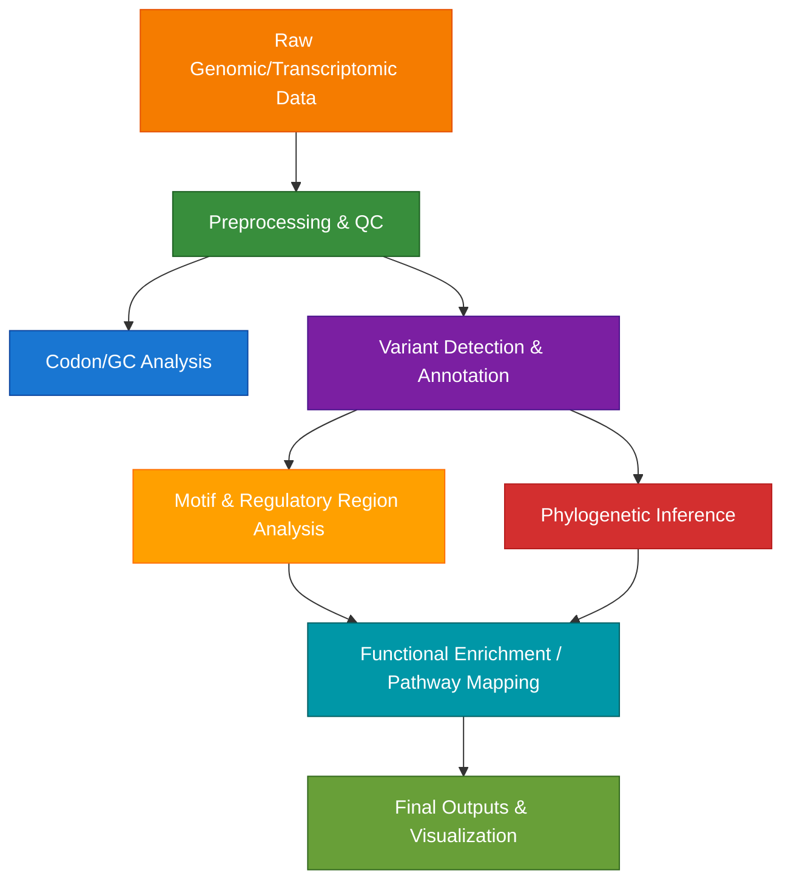

# 🧬 Computational Biology Toolkit
[](LICENSE)


## 📘 Description
This repository provides a curated set of Python-based tools for key tasks in computational biology, with a focus on genomics, transcriptomics, and evolutionary analysis. The scripts are modular, well-documented, and easily extendable for applications in:

- Variant annotation
- Sequence comparison
- RNA-seq data analysis
- Phylogenetics
- Regulatory element detection
- Metagenomic profiling

Originally developed to support graduate-level research, this toolkit is suitable for researchers and students working across diverse biological datasets — from mammalian genomes to microbial communities.

---

## 🌟 Highlights

- Supports standard file formats (FASTA, VCF, GTF, etc.)
- Minimal dependencies and lightweight structure
- Suitable for both exploration and automation
- Great for teaching and rapid prototyping of pipelines

---
## 🧪 Project Features
### Core Functionalities

- **DNA/RNA sequence analysis**: Translate, compare, and characterize raw nucleotide sequences  
- **Regulatory motif detection**: Identify promoter motifs or codon usage patterns  
- **Phylogenetic modeling**: Construct and analyze evolutionary trees  
- **Mutation & variant annotation**: Detect and annotate clustered or somatic mutations  
- **RNA-seq data processing**: Visualize expression and functional divergence  
- **Metagenomic analysis**: Profile community-wide diversity and function  

---

### Workflow Overview
> The tools in this repository are designed to be modular, but can also be used in sequence as part of a complete analysis workflow. Below is an example of how these components may integrate in a mutation- or expression-driven research pipeline:



---

### Available Scripts (with Applications)

| Script | Description | Use Case |
|--------|-------------|----------|
| `codon_analysis.py` | Codon usage analysis and visualization | Compare codon bias across genes or species |
| `dna-protein.py` | DNA to protein translation in 6 frames | Identify potential ORFs and misannotations |
| `gc_calc.py` | GC content calculation | Assess genomic stability or mutation hotspots |
| `gc_calc_pwa.py` | GC content with pairwise alignment | Compare GC distribution between homologs |
| `phylogenetic_analysis.py` | Tree construction using distance matrices | Infer evolutionary divergence of genes/loci |
| `promoter_id.py` | Motif scanning in upstream regions | Detect conserved promoter motifs |
| `protein_property.py` | Amino acid property summary | Profile hydrophobicity, charge, etc. |
| `protein_seq_motif.py` | Protein motif identification | Detect structural motifs (e.g., kinase domains) |
| `rna_analysis.py` | RNA-Seq processing and visualization | DE analysis, clustering, expression heatmaps |
| `seq_align_score_calc.py` | Needleman-Wunsch / Smith-Waterman scoring | Compare sequence similarity quantitatively |
| `variant_annotation.py` | Annotate genomic variants | Prioritize functional SNPs or clustered mutations |
| `metagenomic.py` | Taxonomic and functional profiling | Analyze shotgun metagenomes (WGS reads) |
| `adhesion_metabolism_crosstalk.py` | Pathway-level interaction mapping | Explore crosstalk between signaling modules |
| `somatic_variation.py` | Compare cancer vs healthy genomes | Detect somatic mutations or LOH regions |

---

## 🚀 Use Case Example

> *Process a FASTA file of variant-rich loci, score GC content and codon usage, and run downstream motif analysis to assess regulatory potential.*

This toolkit can be used to generate publication-ready insights from raw sequence data — whether you’re exploring de novo genes, transcript isoforms, or somatic variant landscapes.

---
## Key Benefits
- Efficiency: Streamlined analysis pipelines
- Reproducibility: Consistent results across platforms
- Educational: Well-documented code for learning
- Extensible: Modular design for customization

---

## ⚙️ Installation
### Requirements
- Python 3.7+
- Biopython
- Common scientific Python stack (NumPy, Pandas, Matplotlib)
---

### Setup
```bash
# Clone the repository
git clone https://github.com/Aridoge13/Computational_Biology.git


# Install dependencies
pip install biopython matplotlib pandas numpy pysam
```
---

## 🤝 Contribution
Feedback, forks, and pull requests are welcome! Feel free to open issues or share feature ideas.

---

## 📄 License
See [LICENSE](License.md) for full terms.

---

## 📫 Contact
Email: aritra.mukherjee98@gmail.com
Linkedin: [Aritra_Mukherjee](www.linkedin.com/in/aritra-mukherjee-82b070125)
ORCID:[Aritra_Mukherjee](https://orcid.org/0000-0002-6061-611X)